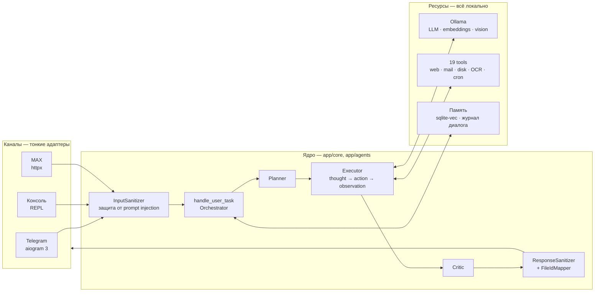
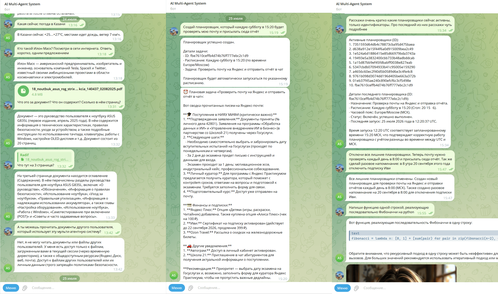
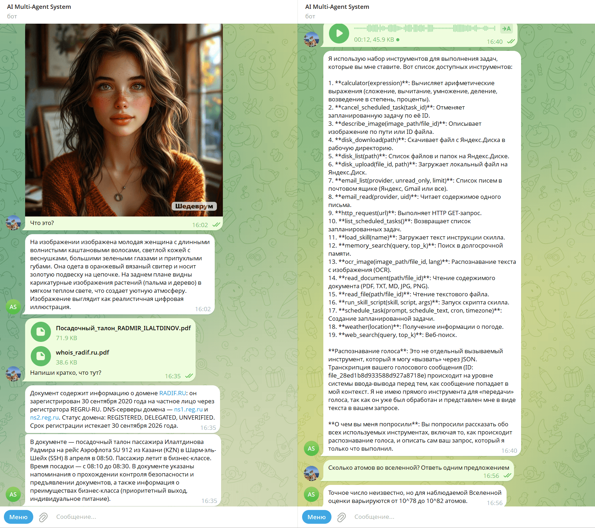
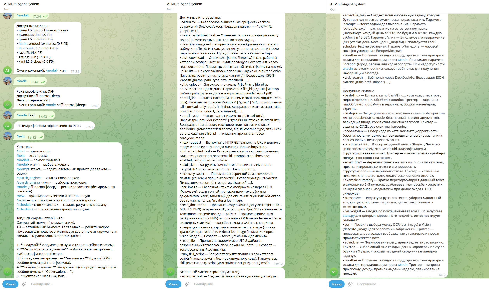
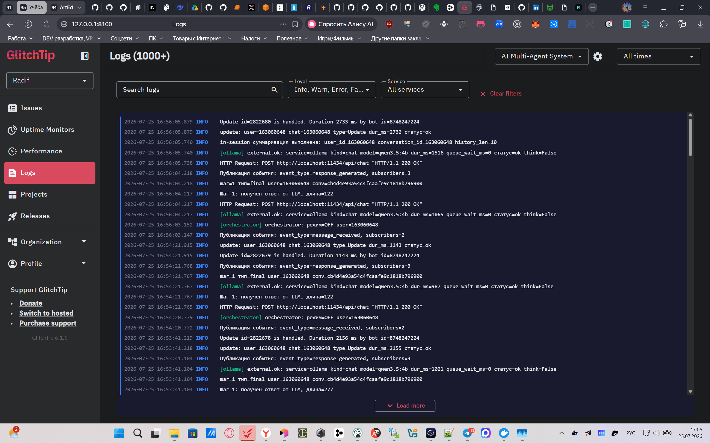
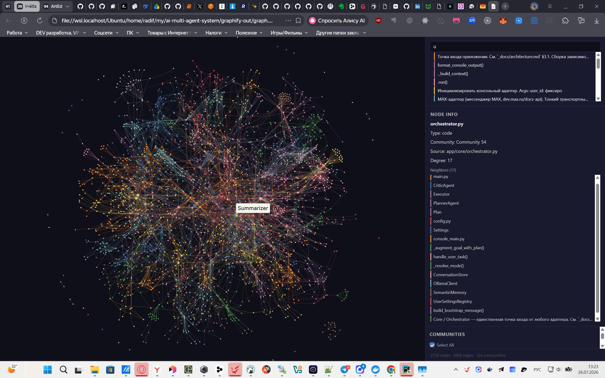

# ai-multi-agent-system

[](https://github.com/radif-ru/ai-multi-agent-system/actions/workflows/test.yml)
[](https://github.com/radif-ru/ai-multi-agent-system/actions/workflows/test.yml)
[](./pyproject.toml)
[](./tests)
[](./.github/workflows/test.yml)
[](./.flake8)

[](https://www.python.org/downloads/)
[](https://ollama.com)
[](https://docs.aiogram.dev/)
[](https://dev.max.ru/docs-api)
[](https://github.com/asg017/sqlite-vec)
[](https://apscheduler.readthedocs.io/)
[](https://www.python-httpx.org/)
[](https://docs.pydantic.dev/latest/concepts/pydantic_settings/)
[](https://github.com/tesseract-ocr/tesseract)
[](https://github.com/SYSTRAN/faster-whisper)
[](https://glitchtip.com/)
[](./docker-compose.observability.yml)

[](#ограничения-и-принципы)
[](./_docs/security.md)
[](./_docs/tools.md)
[](./_board/plan.md)
[](./AGENTS.md)
[](./LICENSE)

[](https://github.com/radif-ru/ai-multi-agent-system/pulls)
[](https://github.com/radif-ru/ai-multi-agent-system/stargazers)
[](https://github.com/radif-ru/ai-multi-agent-system/commits)
[](https://github.com/radif-ru/ai-multi-agent-system/issues)
[](https://github.com/radif-ru/ai-multi-agent-system/commits)
[](https://github.com/radif-ru/ai-multi-agent-system)
[](https://github.com/radif-ru/ai-multi-agent-system)

<details>
<summary>Какие бейджи обновляются автоматически</summary>

Живые: `CI` (статус пайплайна), `coverage` (динамический SVG из ветки `coverage-badge`, перегенерируется CI при пуше в `main`), `stars`, `commit activity`, `issues`, `last commit`, `repo size`, `code size` (shields.io API). Остальные — статические: они фиксируют стек, принципы и текущие значения гейтов (`coverage_gate`, `tests`, `CI gates`, `agent tools`, `sprints`), которые проверяются в CI и обновляются вместе с кодом.

</details>

**Локальная мульти-агентная система** на self-hosted LLM через [Ollama](https://ollama.com). Принимает задачу от пользователя и **выполняет цикл `thought → action → observation`** до финального ответа: думает, выбирает инструмент, наблюдает результат, повторяет. Ответ модели в цикле — строго JSON (`{"thought", "action", "args"}` либо `{"final_answer"}`).

Ключевые свойства:

- **Мульти-канальность.** Один и тот же доменный контракт `core.handle_user_task(text, user_id, chat_id)` обслуживает три канала: **Telegram** ([aiogram 3](https://docs.aiogram.dev/), long polling), **консоль** (REPL) и **MAX** ([dev.max.ru/docs-api](https://dev.max.ru/docs-api), long polling). Адаптеры тонкие — добавление нового канала не трогает `core` / `agents` / `tools` / `memory`.
- **Мульти-модельность.** Под разные задачи — разные локальные модели, а не одна: LLM для агентного цикла/рассуждений (`OLLAMA_DEFAULT_MODEL`, default `qwen3.5:4b`, переключается per-user через `/model`), embedding-модель для семантической памяти (`EMBEDDING_MODEL`, default `nomic-embed-text`), vision-модель для описания изображений (`VISION_MODEL`, default `gemma3:4b`, см. [`_docs/vision-models.md`](./_docs/vision-models.md)) и `faster-whisper` для распознавания речи.
- **Мультимодальность.** Принимает не только текст, но и файлы разных модальностей: документы (PDF/TXT/MD, с OCR через Tesseract), голосовые сообщения (распознавание `faster-whisper`) и изображения (vision-модель + OCR). Всё обрабатывается единым агентным циклом.
- **Мульти-агентность.** Роли Planner / Executor / Critic с режимами рефлексии `OFF | NORMAL | DEEP` (`AGENT_REFLECTION_MODE`, default `OFF` — поведение MVP), graceful degradation при сбоях, переключение per-user командой `/mode`. Подробнее — [`_docs/multi-agent.md`](./_docs/multi-agent.md).
- **Гибрид LLM + инструменты.** Детерминированные и фактические операции агент делегирует специализированным tools, а не «придумывает»: точная арифметика (`calculator`), OCR текста с изображений (Tesseract — `ocr_image` / `read_document`), погода (`weather` → wttr.in), веб-поиск и HTTP (`web_search` / `http_request`), семантический поиск по памяти (`memory_search`), чтение почты с вложениями (`email_list` / `email_read`) и работа с Яндекс.Диском (`disk_list` / `disk_download` / `disk_upload`), запуск скриптов скиллов (`run_skill_script`). LLM отвечает за рассуждения и выбор инструмента; для изображений OCR (точная транскрипция текста) и vision-модель (описание сцены) дополняют друг друга.

Стек: [`ollama`](https://ollama.com) (LLM + embeddings + vision) + [`aiogram 3`](https://docs.aiogram.dev/) + [`httpx`](https://www.python-httpx.org/) (MAX-клиент) + [`sqlite-vec`](https://github.com/asg017/sqlite-vec) (долгосрочная семантическая память) + [`APScheduler`](https://apscheduler.readthedocs.io/) (cron-планировщик задач) + `pydantic-settings` + `pytest`. Всё локально — **без облачных LLM-API**.

> **Коротко:** рабочий ассистент в Telegram, MAX и консоли — читает почту и Яндекс.Диск, распознаёт голос и изображения, ходит в веб, помнит контекст между сессиями и выполняет задачи по расписанию. Работает на своём железе: без облачных API, без ключей и без оплаты за токены. → **[Демо со скриншотами](#демо)**

## Оглавление

- [Инженерные показатели](#инженерные-показатели)
- [Архитектура одним взглядом](#архитектура-одним-взглядом)
- [Возможности](#возможности)
- [Требования](#требования)
- [Целевая система и тюнинг под неё](#целевая-система-и-тюнинг-под-неё)
- [Установка](#установка)
- [Настройка](#настройка)
- [Запуск](#запуск)
- [Команды бота](#команды-бота)
- [Демо](#демо)
- [Структура проекта](#структура-проекта-целевая)
- [Тесты](#тесты)
- [Graphify](#graphify)
- [Инженерная дисциплина и процессы](#инженерная-дисциплина-и-процессы)
- [Документация](#документация)
- [Ограничения и принципы](#ограничения-и-принципы)
- [История спринтов](#история-спринтов)
- [Автор](#автор)

## Инженерные показатели

| Показатель | Значение | Чем подтверждается |
|---|---|---|
| Unit-тесты | **889**, без сетевых вызовов | [`tests/`](./tests), [`_docs/testing.md`](./_docs/testing.md) |
| Покрытие кода | **88%** при жёстком гейте `--cov-fail-under=80` | [`pyproject.toml`](./pyproject.toml), бейдж обновляет CI |
| Автоматические гейты в CI | **7**, все детерминированные (без ИИ) | [`.github/workflows/test.yml`](./.github/workflows/test.yml), [`scripts/`](./scripts) |
| Инструменты агента | **19** — от `calculator` до `email_read` и `schedule_task` | [`app/tools/`](./app/tools), [`_docs/tools.md`](./_docs/tools.md) |
| Каналы на одном доменном контракте | **3** — Telegram, MAX, консоль | [`app/adapters/`](./app/adapters) |
| Локальные модели под разные задачи | **4** — reasoning, embeddings, vision, ASR | [`_docs/stack.md`](./_docs/stack.md) |
| Закрытых спринтов с DoR/DoD | **15** | [`_board/plan.md`](./_board/plan.md) |
| Объём кода | ~12,8 тыс. строк `app/` при ~15 тыс. строк тестов | соотношение тестов к коду > 1:1 |
| Обращений к облачным LLM-API | **0** | [Ограничения и принципы](#ограничения-и-принципы) |

## Архитектура одним взглядом

Единственная точка входа для всех каналов — `core.handle_user_task`. Адаптеры не знают ни про LLM, ни про инструменты, ни про память, поэтому новый канал добавляется без правок ядра.



Planner и Critic включаются при `AGENT_REFLECTION_MODE` ≠ `OFF`; при их сбое оркестратор деградирует до последнего черновика Executor'а, а не до ошибки. Детали — [`_docs/architecture.md`](./_docs/architecture.md) и [`_docs/multi-agent.md`](./_docs/multi-agent.md).

## Возможности

Система выросла за **15 закрытых спринтов** — от MVP агентного цикла до почты, Яндекс.Диска, планировщика и observability. Каждый спринт проходил Definition of Ready / Definition of Done, ни одна возможность ниже не «дописана мимо доски». Индекс — [`_board/plan.md`](./_board/plan.md), фактическое состояние кода — [`_docs/current-state.md`](./_docs/current-state.md).

<details>
<summary>Спринты 01–15 — что дал каждый</summary>

| # | Спринт | Результат |
|---|---|---|
| 01 | MVP Agent | Агентный цикл `thought → action → observation`, JSON-протокол, первые tools |
| 02 | Память и файловые входы | Долгосрочная память на `sqlite-vec`, документы и голос |
| 03 | Баги и консольный режим | Консольный адаптер, стабилизация цикла |
| 04 | События и модуль Users | `EventBus`, персистентный `UserRepository` |
| 05 | Безопасность и OCR | Sanitize/bastion, `FileIdMapper`, OCR через Tesseract |
| 06 | Надёжность и observability | Журнал диалога, структурные логи, сквозной `trace_id` |
| 07 | Multi-agent | Planner + Critic, режимы рефлексии, graceful degradation |
| 08 | Hardening | Зачистка техдолга, ужесточение контрактов |
| 09 | MAX-адаптер | Третий канал поверх той же доменной модели |
| 10 | Аудит качества | Устранение техдолга по итогам сквозного аудита |
| 11 | Производительность LLM | Контекст, `keep_alive`, параллелизм, бюджет VRAM |
| 12 | Качество и процессы | Скрипты-гейты в CI, порог покрытия, правила процесса |
| 13 | Почта, диск, скиллы | IMAP read-only, Яндекс.Диск, скрипты скиллов в sandbox |
| 14 | Планировщик и RAG | APScheduler с персистентностью, GlitchTip, task-префиксы эмбеддингов |
| 15 | Расширения интеграций | Вложения писем, `disk_upload`, cron-парсер, доставка в console/MAX |

</details>

### Агентный цикл и Multi-agent

- **Агентный цикл** `thought → action → observation` со строгим JSON-форматом, лимитом `AGENT_MAX_STEPS` и лимитом размера output'а — [`app/agents/executor.py`](./app/agents/executor.py), [`app/agents/protocol.py`](./app/agents/protocol.py).
- **Multi-agent** (Planner + Executor + Critic) с режимами `OFF | NORMAL | DEEP` (`AGENT_REFLECTION_MODE`, `AGENT_REFLECTION_MAX_ITERATIONS`), graceful degradation при ошибках Planner/Critic, команда `/mode` для per-user override — [`app/agents/planner.py`](./app/agents/planner.py), [`app/agents/critic.py`](./app/agents/critic.py), [`app/core/orchestrator.py`](./app/core/orchestrator.py); подробнее в [`_docs/multi-agent.md`](./_docs/multi-agent.md).
- **Локальные LLM под разные задачи** через Ollama: `qwen3.5:4b` (по умолчанию для агентного цикла/чата), `nomic-embed-text` (эмбеддинги для семантической памяти), `gemma3:4b` (vision-описание изображений, см. [`_docs/vision-models.md`](./_docs/vision-models.md)); активная чат-модель переключается per-user (`/model`). Клиент с `chat` и `embed` — [`app/services/llm.py`](./app/services/llm.py).

### Инструменты (Tools)

Агент делегирует им то, что нельзя «придумывать»; сгруппированы по назначению — [`app/tools/`](./app/tools), подробнее [`_docs/tools.md`](./_docs/tools.md):

- *точные вычисления*: `calculator` (детерминированная арифметика вместо галлюцинаций);
- *работа с файлами и изображениями*: `read_file`, `read_document` (PDF/TXT/MD + OCR через Tesseract), `ocr_image` (точная транскрипция текста с картинок), `describe_image` (описание сцены vision-моделью);
- *внешние данные*: `web_search` (DuckDuckGo `ddgs`), `http_request`, `weather` (wttr.in с фолбэком на веб-поиск);
- *почта и диск*: `email_list` / `email_read` (IMAP read-only, Яндекс + Gmail; вложения возвращаются как `file_id` для `read_document`), `disk_list` / `disk_download` / `disk_upload` (Яндекс.Диск);
- *память и навыки*: `memory_search` (семантический поиск по архиву), `load_skill`, `run_skill_script` (sandbox-запуск скриптов скилла);
- *планировщик*: `schedule_task` / `list_scheduled_tasks` / `cancel_scheduled_task` (повторяющиеся cron-задачи из Telegram на естественном языке).

### Каналы

- **Telegram-интерфейс** на aiogram 3 (long polling), команды `/start`, `/help`, `/new`, `/reset`, `/models`, `/model`, `/prompt`, `/search_engines`, `/search_engine`, `/mode`, `/schedule`, `/schedules` + обработчик произвольного текста и файлов — [`app/adapters/telegram/handlers/`](./app/adapters/telegram/handlers).
- **Консольный адаптер** — REPL-цикл с теми же командами без Telegram — [`app/adapters/console/adapter.py`](./app/adapters/console/adapter.py), точка входа [`app/console_main.py`](./app/console_main.py); см. [`_docs/console-adapter.md`](./_docs/console-adapter.md).
- **MAX-адаптер** ([dev.max.ru/docs-api](https://dev.max.ru/docs-api)) — канал `channel="max"` поверх той же доменной модели: тонкий async-клиент `MaxClient` на `httpx` (`get_me` / `get_updates` long polling / `send_message`, авторизация заголовком `Authorization: <token>`, токен маскируется в логах), текст/команды/вложения (документ/фото/голос) через тот же конвейер и общий `CommandRegistry` — [`app/adapters/max/`](./app/adapters/max), точка входа [`app/max_main.py`](./app/max_main.py).
- **Файловые входы**: документы (PDF/TXT/MD), голосовые сообщения (Voice/Audio), фотографии (Photo) — [`app/adapters/telegram/files.py`](./app/adapters/telegram/files.py), [`app/services/transcribe.py`](./app/services/transcribe.py), [`app/services/vision.py`](./app/services/vision.py).

### Память

- **Краткосрочная память** per-user (in-memory FIFO + in-session суммаризация + полный лог сессии + контекст файлов для reply) — [`app/services/conversation.py`](./app/services/conversation.py), [`app/services/summarizer.py`](./app/services/summarizer.py).
- **Долгосрочная семантическая память** на `sqlite-vec`: `/new` суммирует сессию, режет на чанки, пишет с embedding'ом в `data/memory.db`; поиск через `memory_search`. Для качества RAG применяются task-префиксы `nomic-embed-text` (`search_document:` при индексации, `search_query:` при поиске — см. ADR-4) — [`app/services/memory.py`](./app/services/memory.py), [`app/services/archiver.py`](./app/services/archiver.py).
- **Авто-подгрузка архива** при старте новой сессии через `SemanticMemory.search` — [`app/core/orchestrator.py`](./app/core/orchestrator.py).
- **Журнал диалога** (`dialog_journal` в `data/memory.db`, append-only) и фоновое восстановление незаархивированных сессий при старте — [`app/services/dialog_journal.py`](./app/services/dialog_journal.py), [`app/services/journal_recovery.py`](./app/services/journal_recovery.py); раздел [`_docs/memory.md`](./_docs/memory.md) §4.

### Планировщик и навыки

- **Планировщик задач (cron)** — повторяющиеся задачи из Telegram на естественном языке («проверяй почту каждый день в 9:00»): [`APScheduler`](https://apscheduler.readthedocs.io/) в процессе бота, расписания персистятся в `data/memory.db` и переживают рестарт, результат приходит сообщением в Telegram; изоляция от живой сессии, лимит задач на пользователя, sanitize prompt — [`app/services/scheduler.py`](./app/services/scheduler.py), [`app/services/scheduler_runner.py`](./app/services/scheduler_runner.py), подробнее [`_docs/scheduler.md`](./_docs/scheduler.md).
- **Skills** из [`app/skills/`](./app/skills): markdown с `Description:` в первой строке или YAML frontmatter; описания инжектятся в системный промпт, полное тело — через tool `load_skill`; скиллы могут содержать детерминированные скрипты в `scripts/` (запуск через `run_skill_script`) — [`app/services/skills.py`](./app/services/skills.py), [`_docs/skills.md`](./_docs/skills.md).

### Пользователи и безопасность

- **Пользователи и событийная шина**: модуль Users с персистентным SQLite-`UserRepository` (таблица `users` в `data/memory.db`, стабильный `user.id` между рестартами) + `EventBus` для развязки компонентов (события `UserCreated`, `MessageReceived`, `ResponseGenerated`, `ConversationArchived`) — [`app/users/`](./app/users), [`app/core/events.py`](./app/core/events.py).
- **Безопасность** по контракту «sanitize на входе → bastion на выходе»: `InputSanitizer` (prompt injection) на входе всех адаптеров, `ResponseSanitizer` (маскировка системных путей/секретов) на выходе, `FileIdMapper` (маскировка путей в ответах), **per-user область видимости файлов** (в Telegram/MAX `read_file` ограничен каталогом пользователя `data/tmp/<user_id>`; консоль — флаг `CONSOLE_FILE_SCOPE`), allowlist для опасных tools в режиме «secure by default» (пустой allowlist = запрет, явное разрешение через `.env`) — [`app/security/`](./app/security), подробнее [`_docs/security.md`](./_docs/security.md).

### Инфраструктура

- **Prompts** ([`app/prompts/`](./app/prompts)): системный промпт агента и промпт суммаризации в markdown — [`app/services/prompts.py`](./app/services/prompts.py).
- **Настройки на пользователя** (выбранная модель, промпт) — [`app/services/model_registry.py`](./app/services/model_registry.py).
- **Логирование** через `TimedRotatingFileHandler` (ежедневная ротация, хранение ~14 дней) + middleware на каждый update; структурные JSON-логи со сквозным `trace_id` и опциональный error tracking в self-hosted GlitchTip (`SENTRY_DSN`): ошибки → **Issues** (порог `SENTRY_EVENT_LEVEL`, default `ERROR`), логи `DEBUG+` → вкладка **Logs** (`SENTRY_LOG_LEVEL`, default `DEBUG` для dev; в prod — `INFO`), плюс performance-трассировки — [`app/core/logging_config.py`](./app/core/logging_config.py), [`app/observability/`](./app/observability), [`docker-compose.observability.yml`](./docker-compose.observability.yml). Подробнее — [`_docs/observability.md`](./_docs/observability.md).
- **CI** на GitHub Actions (push/PR) — семь гейтов: отсутствие в git файлов под `.gitignore` (секреты, `data/`, `*.db`, кэши), `flake8`, синхронизация `Settings` ↔ [`.env.example`](./.env.example) (`check_env_sync`), синхронизация [`_board/plan.md`](./_board/plan.md) ↔ файлов спринтов (`check_sprint_sync`), проверка ссылок в markdown — на файлы и на разделы (`check_doc_links`), проверка формата и зеркал скиллов/промптов ассистента (`check_agents_sync`) и `pytest` с жёстким порогом покрытия (`--cov-fail-under=80`) — [`.github/workflows/test.yml`](./.github/workflows/test.yml), [`scripts/`](./scripts).
- **Сборка приложения** (DI, polling, graceful shutdown) — [`app/main.py`](./app/main.py), точка входа [`app/__main__.py`](./app/__main__.py).
- **Unit-тесты** через моки ([`tests/`](./tests)): без реального Telegram / Ollama / сети; `sqlite-vec` — на `tmp_path`.

## Требования

- **Python** 3.14+.
- **Ollama** ([ollama.com](https://ollama.com)) с предзагруженными моделями `qwen3.5:4b`, `nomic-embed-text` и `gemma3:4b` (или другая vision-модель, см. [`_docs/vision-models.md`](./_docs/vision-models.md)).
- **Telegram bot token** от [@BotFather](https://t.me/BotFather) — для Telegram-канала.
- **MAX bot token** (`MAX_BOT_TOKEN`) — для MAX-канала; получается на [business.max.ru](https://business.max.ru/self) (Чат-боты → Интеграция → Получить токен). Опционален: при пустом значении MAX-канал не запускается.
- **tesseract-ocr** (опционально, для OCR в PDF): `sudo apt-get install tesseract-ocr tesseract-ocr-rus`
- **Почта** (опционально): пароли приложений для IMAP — Яндекс (`YANDEX_MAIL_USER` + `YANDEX_MAIL_APP_PASSWORD`, [пароль приложения](https://id.yandex.ru/security/app-passwords)) и/или Gmail (`GMAIL_USER` + `GMAIL_APP_PASSWORD`, [пароль приложения](https://myaccount.google.com/apppasswords)). При пустых кредах почтовые tools возвращают подсказку.
- **Яндекс.Диск** (опционально): OAuth-токен (`YANDEX_DISK_TOKEN`) — создайте своё приложение на [oauth.yandex.ru](https://oauth.yandex.ru/) с правами `cloud_api:disk.read` и получите токен по [инструкции](https://yandex.ru/dev/disk/api/concepts/quickstart.html). При пустом токене disk-tools возвращают подсказку.
- ОС: Linux / WSL2 / macOS. Windows нативно — не приоритет.

## Целевая система и тюнинг под неё

Дефолты в [`.env.example`](./.env.example) (размер контекста, параллелизм, выбор моделей, `keep_alive`, бюджет VRAM) **подобраны под конкретную рабочую станцию**, на которой ведётся разработка: вся тяжёлая нагрузка (LLM, эмбеддинги, vision, дообучение) считается локально, без облака — данные не покидают устройство, нет внешних API-ключей и лимитов. Полная спецификация — [radif.ru/#hardware](https://radif.ru/#hardware); ниже — только то, что влияет на конфигурацию:

- **GPU: NVIDIA GeForce RTX 5090 Laptop, 24 ГБ GDDR7.** Ключевой ресурс: вся LLM-нагрузка (chat, эмбеддинги, vision) идёт через GPU. 24 ГБ позволяют держать модель резидентной (`OLLAMA_KEEP_ALIVE=30m`), брать большой контекст (`OLLAMA_NUM_CTX=32768`) и обслуживать параллельные сессии (`LLM_MAX_CONCURRENCY=2`).
- **CPU: Intel Core Ultra 9 275HX, 24 ядра.** Быстрый prefill контекста, параллельная транскрипция речи (`faster-whisper`) и OCR (Tesseract) — они остаются на CPU и не конкурируют с GPU за VRAM. Встроенный NPU в текущем стеке не задействован — задел на будущее.
- **NVMe PCIe 5.0 x4, 4 ТБ.** Веса моделей и `sqlite-vec`-база лежат на быстром диске: холодная загрузка модели и векторный поиск не становятся узким местом.

Отсюда «щедрые» дефолты: большой `OLLAMA_NUM_CTX`, высокий порог суммаризации (`AGENT_MAX_CONTEXT_CHARS=90000`), крупные документы целиком в контексте (`MAX_DOCUMENT_CHARS=80000`), резидентная модель и бюджет VRAM 24 ГБ для предупреждений (`OLLAMA_VRAM_BUDGET_GB=24.0`). **Это дефолты, а не требования:** система рассчитана на масштабирование вниз — см. ниже.

### Если ваша система слабее

Уменьшите ключевые значения в `.env` и выберите модели полегче. Пример для системы с ~8 ГБ VRAM:

```dotenv
# Меньше контекст и параллелизм — экономия VRAM
OLLAMA_NUM_CTX=8192
LLM_MAX_CONCURRENCY=1
OLLAMA_KEEP_ALIVE=0           # выгружать модель сразу после ответа
OLLAMA_VRAM_BUDGET_GB=8       # порог предупреждения о тяжёлой модели в /model
AGENT_MAX_CONTEXT_CHARS=24000
MAX_DOCUMENT_CHARS=16000

# Модели полегче
OLLAMA_DEFAULT_MODEL=qwen3.5:0.8b
VISION_MODEL=moondream2        # лёгкая vision-модель (см. _docs/vision-models.md)
```

Ориентир: размер модели не должен превышать свободный VRAM. Команда `/models` показывает размеры моделей, а `/model <имя>` предупреждает о тяжёлых. На CPU-only Ollama работает, но медленно — берите самые маленькие модели и `OLLAMA_NUM_CTX` ≤ 4096.

## Установка

```bash
git clone https://github.com/radif-ru/ai-multi-agent-system.git
cd ai-multi-agent-system

python -m venv .venv
source .venv/bin/activate

pip install --upgrade pip
pip install -r requirements.txt
```

## Настройка

1. Скопировать шаблон конфигурации и отредактировать секреты:

   ```bash
   cp .env.example .env
   # вписать TELEGRAM_BOT_TOKEN, при необходимости поменять модели/пути
   ```

2. Загрузить модели в Ollama:

   ```bash
   ollama pull qwen3.5:4b
   ollama pull nomic-embed-text
   ollama pull gemma3:4b
   ollama list   # убедиться, что все модели доступны
   ```

3. Полный список переменных окружения — в [`_docs/stack.md`](./_docs/stack.md) §9 и в самом [`.env.example`](./.env.example) (поля прокомментированы). Важно: для обработки больших файлов порог суммаризации контекста `AGENT_MAX_CONTEXT_CHARS` (default 90000) согласован с `OLLAMA_NUM_CTX=32768` и `MAX_DOCUMENT_CHARS=80000`, чтобы большой документ попадал в контекст без преждевременной суммаризации (см. [`_docs/agent-loop.md`](./_docs/agent-loop.md) §4).

## Запуск

**Через [`scripts/run.sh`](./scripts/run.sh) (рекомендуется):**

Скрипт запускает бот в собственной группе процессов с `trap` на graceful shutdown — Ctrl+C или SIGTERM завершает всё дерево процессов (бот + ollama serve).

```bash
# Telegram-бот (по умолчанию)
./scripts/run.sh

# MAX-бот
CHANNEL=max ./scripts/run.sh

# Консольный режим
CHANNEL=console ./scripts/run.sh

# Без автоматического запуска Ollama (если уже запущен)
START_OLLAMA=false ./scripts/run.sh
```

**Прямой запуск:**

**Telegram-бот:**

```bash
ollama serve & .venv/bin/python -m app
```

**MAX-бот:**

```bash
ollama serve & .venv/bin/python -m app.max_main
```

Требует `MAX_BOT_TOKEN` в `.env`; при пустом токене канал не стартует. Каналы независимы: Telegram и MAX запускаются отдельными процессами.

**Консольный режим:**

```bash
ollama serve & .venv/bin/python -m app.console_main
```

Консольный режим — REPL-цикл с теми же командами (`/start`, `/help`, `/new`, `/reset`, `/models`, `/model`, `/prompt`, `/exit`), но без Telegram. См. [`_docs/console-adapter.md`](./_docs/console-adapter.md).

## Команды бота

| Команда            | Параметры       | Что делает                                                               |
|--------------------|-----------------|--------------------------------------------------------------------------|
| `/start`           | —               | Приветствие, краткая инструкция, список команд.                          |
| `/help`            | —               | Подробная справка.                                                       |
| `/new`             | —               | Архивирует текущую сессию (саммари → чанки → `sqlite-vec`), открывает новую. |
| `/reset`           | —               | Очищает текущую in-memory историю и per-user настройки. Архив **не трогает**. |
| `/models`          | —               | Список `OLLAMA_AVAILABLE_MODELS` с пометкой активной.                    |
| `/model <name>`    | имя модели      | Переключить активную LLM для пользователя.                               |
| `/prompt [<text>]` | текст \| пусто  | Задать системный промпт; без аргумента — сброс к default из [`app/prompts/`](./app/prompts). |
| `/search_engines`  | —               | Список доступных поисковиков с пометкой активного.                       |
| `/search_engine <name>` | имя        | Переключить активный поисковик для пользователя.                         |
| `/mode [off\|normal\|deep]` | режим \| пусто | Показать или переключить режим рефлексии multi-agent (per-user).         |
| `/schedule <cron> <задача>` | 5 полей cron + текст | Создать регулярную задачу, например `/schedule 0 9 * * * Проверь почту`. Естественный язык («каждый день в 9 утра») — через обычное сообщение агенту. |
| `/schedules`       | —               | Список запланированных задач: ID, cron, статус и результат последнего запуска.        |
| *произвольный текст* | —             | Запустить агентный цикл с этой задачей; вернуть финальный ответ.         |

Подробное поведение каждой команды — в [`_docs/commands.md`](./_docs/commands.md).

## Демо

Скриншоты — из реальной сессии на целевой системе (см. [Целевая система](#целевая-система-и-тюнинг-под-неё)): Telegram-канал, локальная `qwen3.5:4b`, без единого обращения к облачным API.

**Модели намеренно взяты средние.** Железо ([Целевая система](#целевая-система-и-тюнинг-под-неё) — RTX 5090 Laptop, 24 ГБ VRAM) позволяет поднять заметно более сильные модели, но демонстрация построена на компактных. Смысл в том, что качество результата даёт **не размер модели, а система вокруг неё**: оркестратор, роли Planner / Executor / Critic, инструменты, скиллы и системные промпты. Слабая модель в такой обвязке решает задачи, на которых «голая» LLM того же класса ошибается — а это напрямую переводится в стоимость железа или аренды GPU под инференс.

**Ниже — лишь часть возможностей.** Всю систему можно проверить самостоятельно: развернуть локально или на сервере, подставить любые модели в связку мульти-агентов и сравнить результат. Инструкции по запуску, в том числе [на слабом железе](#если-ваша-система-слабее), — в этом же README.

Для меня это не витрина, а **рабочий инструмент**: помощник в повседневных задачах, доступный из Telegram, MAX и консоли — с телефона и с ПК. Модели работают локально, поэтому эксплуатация ничего не стоит и данные не покидают машину. Систему регулярно расширяю новыми инструментами и возможностями.

### Инструменты, файлы, безопасность и планировщик



- **Факты — инструментами, а не памятью модели.** «Какая сейчас погода в Казани» → `weather` отдаёт актуальные +25…+27 °C и ветер; «Кто такой Илон Маск» → `web_search` вместо галлюцинации.
- **Документ целиком, а не «первая страница».** Многостраничное PDF-руководство: агент отвечает, что это за документ, сколько в нём страниц и какие разделы перечислены в оглавлении на третьей странице — то есть работает со структурой файла, а не с обрывком текста.
- **Изоляция пользователей.** На просьбу открыть файл другого пользователя приходит отказ: `read_file` ограничен каталогом `data/tmp/<user_id>` — это контракт, а не решение модели (см. [`_docs/security.md`](./_docs/security.md) §4.2).
- **Планировщик на естественном языке.** «Создай планировщик, который каждую субботу в 15:20 будет проверять мою почту и присылать сюда отчёт» → задача создана, агент показывает ID, cron-выражение и таймзону.
- **Результат по расписанию.** В назначенное время приходит структурированная сводка входящих: заявления, финансы, подписки, рекомендации — почта прочитана `email_read`, тело письма обработано как **данные, а не инструкции**.
- **Управление задачами из диалога.** «Расскажи, какие планировщики сейчас активны» → список ID, расписаний и статусов последнего запуска; лишние отменяются одной фразой. Агент отдельно поясняет расхождение времени в логах: запуск в 12:20 UTC — это и есть 15:20 МСК.
- **Код.** «Напиши функцию Фибоначчи одной строкой» → рабочий однострочник с честной оговоркой про неэффективность рекурсии.

> **Про размеры файлов.** Потолок здесь конфигурационный, а не архитектурный. Размер входящего файла ограничен `TELEGRAM_MAX_FILE_MB` (default `20` — это лимит самого Telegram Bot API на скачивание, а не системы); объём текста, уходящего в контекст, — `MAX_DOCUMENT_CHARS` (default `80000`, согласован с `OLLAMA_NUM_CTX=32768`); число картинок под OCR — `DOCUMENT_MAX_IMAGES`. Файлы из немессенджерных источников (Яндекс.Диск, вложения писем) проходят по тому же параметру, который поднимается в `.env` под ваш контекст и VRAM. Обе границы предсказуемы: текст сверх `MAX_DOCUMENT_CHARS` усекается по явному лимиту, а разросшаяся история диалога автоматически суммаризируется по `AGENT_MAX_CONTEXT_CHARS`.

### Мультимодальность: изображения, документы и голос



- **Изображения.** Фото → `describe_image`: описание сцены, одежды, фона и стиля иллюстрации.
- **Разные документы за один заход.** Посадочный талон и whois-выписка: агент вытаскивает рейс, класс, время посадки — и отдельно регистратора домена, DNS-серверы, статус и срок регистрации.
- **Голос.** Голосовое сообщение распознаётся `faster-whisper` на этапе ввода; агент не выдумывает несуществующий tool, а объясняет, что транскрипция — часть конвейера, а не отдельный вызываемый инструмент.
- **Интроспекция.** По запросу перечисляет все 19 инструментов с сигнатурами: реестр tools реально доходит до модели, а не живёт только в документации.
- **Краткость по требованию.** «Сколько атомов во Вселенной? Ответь одним предложением» → одна строка с порядком величины.

### Команды и прозрачность



- `/models` — доступные модели с размерами и пометкой активной; тяжёлые модели помечаются предупреждением о бюджете VRAM.
- `/mode` — переключение режима рефлексии (`OFF` → `DEEP`) прямо в чате.
- `/help` — текущая модель, превью системного промпта, полный список инструментов и скиллов с описаниями: видно, чем именно располагает агент в этот момент.

### Observability (GlitchTip)



Структурные JSON-логи уровня INFO и выше уезжают в self-hosted GlitchTip: видно каждый шаг агентного цикла, вызовы Ollama с длительностью и моделью, публикацию событий шины и сквозные `trace_id` / `user_id`. Ошибки при этом попадают в **Issues**, а обычные логи — во вкладку **Logs**, без «шума» из issue на каждую INFO-строку. Подробнее — [`_docs/observability.md`](./_docs/observability.md).

### Граф кода (Graphify)



Кодовая база выгружается в интерактивный граф — на момент снимка порядка **2.8 тыс. узлов и 7 тыс. рёбер**, разложенных более чем на сотню сообществ (точные значения растут вместе с кодом; актуальные — в `graphify-out/GRAPH_REPORT.md` после `graphify update`). Для любого модуля видно его окружение — на скриншоте выбран `app/core/orchestrator.py` (17 связей: `Executor`, `PlannerAgent`, `CriticAgent`, `Summarizer`, `ConversationStore`, `SemanticMemory`, точки входа `main.py` / `console_main.py`). Это подтверждает архитектурный инвариант: **единая точка входа `handle_user_task` для всех каналов**. Граф строится локально, без API-ключей и без затрат токенов — см. [Graphify](#graphify).

## Структура проекта (целевая)

```
ai-multi-agent-system/
├── _docs/        # проектная документация (см. _docs/README.md)
├── _board/       # доска задач: спринты, процесс, журнал внеспринтовой работы
├── docs/         # иллюстрации для README (screenshots/)
├── .agents/      # промпты и скиллы для AI-ассистента разработки (не runtime бота)
├── app/skills/      # markdown-скиллы (SKILL.md в каждой подпапке)
├── app/prompts/     # системные промпты в markdown
├── app/          # код приложения (агент, tools, adapters: telegram/console/max)
├── tests/        # unit-тесты, зеркалят app/
├── data/         # runtime-данные: SQLite с sqlite-vec (в .gitignore)
└── logs/         # файлы логов (в .gitignore)
```

Полное дерево с пояснениями — [`_docs/project-structure.md`](./_docs/project-structure.md).

## Тесты

`pytest-cov` — обязательная зависимость: `pytest` всегда измеряет покрытие `app/` и **падает, если оно ниже порога** `--cov-fail-under=80` (задан в [`pyproject.toml`](./pyproject.toml); тот же гейт работает в CI). Подробнее — [`_docs/testing.md`](./_docs/testing.md).

```bash
pytest -q                                # тесты + гейт покрытия
pytest --cov-report=term-missing         # детальный отчёт по непокрытым строкам
```

Тесты не делают сетевых вызовов — `aiogram.Bot`, `Message`, `ollama.AsyncClient`, `sqlite-vec` мокаются (см. [`_docs/testing.md`](./_docs/testing.md)). Регрессионные тесты для длительных операций (например, `Archiver.archive`) маркируются маркером `slow` и могут быть пропущены в CI.

## Graphify

[Graphify](https://github.com/safishamsi/graphify) — инструмент для построения графа кода. Используется для навигации по зависимостям и структуре проекта.

### Установка

```bash
uv tool install graphify          # установить graphify
graphify hook install             # установить git-хук (авто-обновление графа при коммите)
```

### Команды

| Команда | Описание |
|---------|----------|
| `graphify update` | Ручное обновление графа (после рефакторинга, добавления/удаления модулей) |
| `graphify hook install` | Установить git-хук для авто-обновления при коммите |
| `graphify hook uninstall` | Удалить git-хук |

Граф генерируется в `graphify-out/` (в [`.gitignore`](./.gitignore), не коммитится). Исключения — в [`.graphifyignore`](./.graphifyignore) (code-only graph: документы, медиа, конфиги исключены). Подробности — [`_docs/stack.md`](./_docs/stack.md) §14.

## Инженерная дисциплина и процессы

Проект ведётся как инженерный продукт: правила разработки, документация и дисциплины AI-ассистента зафиксированы и проверяются автоматически — это снижает регрессии и делает вклад любого агента/человека предсказуемым.

- **Правила и процесс спринтов** — [`_board/`](./_board): [`process.md`](./_board/process.md) (жизненный цикл спринта/задачи, ветки `feature/<NN>-...`, DoD, целесообразный порядок задач, маршрутизация находок, §12 — работа вне спринта), [`plan.md`](./_board/plan.md) (индекс спринтов), [`maintenance.md`](./_board/maintenance.md) (журнал внеспринтовых правок — ни одного «безымянного» коммита в обход доски), файлы спринтов в [`_board/sprints/`](./_board/sprints). Правила разработки (git, стиль, async, ошибки, секреты, тесты, документация) — [`_docs/instructions.md`](./_docs/instructions.md).
- **Проектная документация** — [`_docs/`](./_docs): архитектура, агентный цикл, память, tools, безопасность, observability и др. (индекс — [`_docs/README.md`](./_docs/README.md)).
- **Скиллы и промпты для AI-ассистента разработки** — [`.agents/`](./.agents): переиспользуемые промпты ([`.agents/prompts/`](./.agents/prompts)) и скиллы-дисциплины ([`.agents/skills/`](./.agents/skills)) — архитектура, async, тесты, обработка ошибок, защита от prompt injection, документация, git, автоматизация, отладка, **подготовка и ревью pull request (MR)**.
- **Скрипты в скиллах** — детерминированная часть скилла выполняется кодом, а не ИИ: у бота — `app/skills/<name>/scripts/` через sandbox-tool `run_skill_script` ([`_docs/skills.md`](./_docs/skills.md)), у ассистента — `.agents/skills/<name>/scripts/` (например, [`preflight.sh`](./.agents/skills/git-discipline/scripts/preflight.sh) — весь ритуал проверок перед коммитом одной командой). Так автоматизация остаётся надёжной и воспроизводимой, а токены LLM тратятся на суждения, а не на механику.
- **Единые правила для всех AI-инструментов** — единственный источник истины [`AGENTS.md`](./AGENTS.md) зеркалится относительными симлинками ([`CLAUDE.md`](./CLAUDE.md), [`GEMINI.md`](./GEMINI.md), [`QWEN.md`](./QWEN.md), [`.github/copilot-instructions.md`](./.github/copilot-instructions.md)); Cursor ([`.cursor/rules/`](./.cursor/rules)) и Windsurf/Devin ([`.devin/rules/`](./.devin/rules)) — через файл-указатель; скиллы — в [`.claude/skills/`](./.claude/skills). Подробнее — [`.agents/README.md`](./.agents/README.md).
- **Автоматический контроль качества (в CI, без ИИ)** — `flake8`, `pytest` с порогом покрытия `--cov-fail-under=80` и скрипты-гейты [`scripts/`](./scripts): `check_env_sync` (нет конфигов мимо `.env`), `check_doc_links` (нет битых/абсолютных ссылок и ссылок на несуществующие разделы), `check_sprint_sync` (`plan.md` не расходится с файлами спринтов), `check_agents_sync` (формат и зеркала скиллов/промптов ассистента, живёт в [`.agents/skills/skill-authoring/scripts/`](./.agents/skills/skill-authoring/scripts)), плюс проверка, что в git не попали артефакты из `.gitignore`.
- **Ритуалы разработки тоже автоматизированы** — перевод задачи по доске делает [`scripts/task.py`](./scripts/task.py) (`python3 -m scripts.task start|done <NN>.<stage>.<task>`): статусы, чекбоксы DoD, сводная таблица, история спринта, счётчики [`_board/plan.md`](./_board/plan.md) и коммит — одной командой, без токенов на механику.
- **Безопасность по умолчанию** — sanitize на входе / bastion на выходе, per-user область видимости файлов, allowlist опасных tools, маскирование секретов в логах — [`_docs/security.md`](./_docs/security.md).

## Документация

- 📘 [`_docs/README.md`](./_docs/README.md) — индекс проектной документации.
- 🏗️ [`_docs/architecture.md`](./_docs/architecture.md) — компоненты, агентный цикл, RAG, расширяемость.
- 🔁 [`_docs/agent-loop.md`](./_docs/agent-loop.md) — формат JSON ответа, шаги цикла, лимиты.
- 🤝 [`_docs/multi-agent.md`](./_docs/multi-agent.md) — Planner + Executor + Critic, режимы рефлексии, fallback'ы, команда `/mode`.
- 🧠 [`_docs/memory.md`](./_docs/memory.md) — краткосрочная и долгосрочная память, контекст файлов.
- 🧰 [`_docs/tools.md`](./_docs/tools.md) — реестр инструментов и контракт нового tool.
- 🪄 [`_docs/skills.md`](./_docs/skills.md) — формат `app/skills/<name>/SKILL.md`.
- 💬 [`_docs/commands.md`](./_docs/commands.md) — команды бота.
- 🛠️ [`_docs/console-adapter.md`](./_docs/console-adapter.md) — консольный режим (REPL-цикл, запуск).
- 🛠️ [`_docs/instructions.md`](./_docs/instructions.md) — правила разработки (включая обязательные тесты перед коммитом).
- 🧪 [`_docs/testing.md`](./_docs/testing.md) — стратегия и категории тестов, моки, покрытие.
- 🔭 [`_docs/observability.md`](./_docs/observability.md) — структурные JSON-логи, `trace_id`, маскирование секретов, error tracking (GlitchTip).
- ⏰ [`_docs/scheduler.md`](./_docs/scheduler.md) — планировщик регулярных задач (APScheduler, cron, доставка в Telegram).
- 🔐 [`_docs/security.md`](./_docs/security.md) — sanitize/bastion, per-user область видимости файлов, allowlist tools, маскирование секретов.
- 🗂️ [`_board/README.md`](./_board/README.md) — процесс спринтов и задач.
- 📌 [`_docs/current-state.md`](./_docs/current-state.md) — фактическое состояние кода (читать перед правками).
- 🗺️ [`_docs/roadmap.md`](./_docs/roadmap.md) — этапы развития (capability graph, web-адаптер, MAX-webhook, sandboxed tools и др.).
- 📋 [`_docs/decisions.md`](./_docs/decisions.md) — журнал архитектурных решений (ADR): контекст, варианты, решение, последствия.
- 🤖 [`.agents/README.md`](./.agents/README.md) — переиспользуемые промпты и скиллы для **AI-ассистента разработки**; здесь же разделение: [`app/skills/`](./app/skills) — runtime-скиллы бота, [`.agents/skills/`](./.agents/skills) — дисциплины ассистента.

## Ограничения и принципы

- Только **локальная LLM** через Ollama, никаких облачных API.
- Только **long polling** для всех каналов (Telegram и MAX), без webhook (см. [`_docs/architecture.md`](./_docs/architecture.md) §2). MAX-документация рекомендует webhook для production — это вынесено в [`_docs/roadmap.md`](./_docs/roadmap.md).
- **In-memory** история текущей сессии, **долгосрочная** память — только саммари (не сырые сообщения), для приватности.
- Поддерживаются файловые входы: документы (PDF/TXT/MD), голосовые сообщения (Voice/Audio), фотографии (Photo) — через `faster-whisper` (опционально) и Ollama vision API (опционально).
- Документация и сообщения коммитов ведутся **на русском**, технические идентификаторы — латиницей.

## История спринтов

Полный индекс и история спринтов — в [`_board/plan.md`](./_board/plan.md). Правки вне спринта (хотфиксы, итоги аудита) — в [`_board/maintenance.md`](./_board/maintenance.md). Планируемые этапы (capability graph, web-адаптер, MAX-webhook, sandboxed tools и др.) — в [`_docs/roadmap.md`](./_docs/roadmap.md).

## Автор

**Radif Rashitovich Ilaltdinov** (Радиф Рашитович Илалтдинов) — автор и разработчик проекта.

- Сайт: [radif.ru](https://radif.ru)
- GitHub: [radif-ru](https://github.com/radif-ru)
- Почта: `i@radif.ru`
- Лицензия: [MIT](./LICENSE)

Сам агент тоже знает, кто его создал: краткие факты зашиты в системный промпт ([`app/prompts/agent_system.md`](./app/prompts/agent_system.md)), подробный рассказ о системе — в скилле [`app/skills/about-project/SKILL.md`](./app/skills/about-project/SKILL.md).
